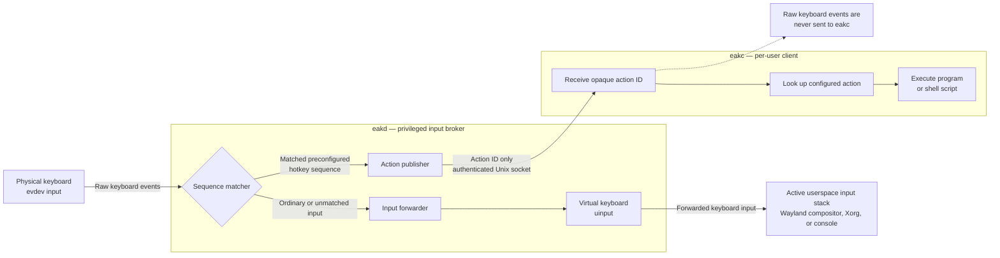

# EAKD/EAKC

EAKD/EAKC is an environment-agnostic solution for managing hotkeys in Linux.
`eakd` serves as the privileged input broker; `eakc` is the user-side client.
Both need to be installed and running for mapped actions to execute.

`eakd` grabs eligible idle physical keyboard evdev nodes and exposes
a virtual keyboard through uinput. The virtual keyboard is used to forward
ordinary input to the userspace input stack. It consumes configured Emacs-style
key sequences such as `Logo+T, 1`. These sequences generate actions that are
sent to connected authorised clients. The client executes programs or runs
shell scripts configured for specific action IDs. It never receives raw
keyboard events from `eakd` to make sure that it doesn't accidentally turn
into a universal keylogger.

The active display or input stack, such as a Wayland compositor, the Xorg
server, or the Linux virtual console, is authoritative for Caps Lock, Num Lock,
and Scroll Lock. `eakd` mirrors the `EV_LED` feedback received through its
virtual keyboard to every connected keyboard that exposes the corresponding
LED; it never infers lock state from raw keys.

## Basic flow



## Build and install

```sh
make test
make vet
make build
sudo make install
```

`make build` compiles both binaries as the current user. `make install` installs
the pre-built binaries, the system and user systemd units, the sysusers and
modules-load configurations, the udev rule, and example configurations. This
separation supports user-scoped Go installations such as mise when the install
step needs root privileges. The install step then creates the `eakd` system
account, loads uinput, reloads the udev rules, and reloads the systemd manager.
It does not enable or start either service. An existing `/etc/eak/eakd.json` is
preserved.

The default installation prefix is `/usr`. Packagers can stage the installation
with `DESTDIR`; host-side setup commands are skipped when `DESTDIR` is
non-empty. For example:

```sh
make build
make install DESTDIR=/tmp/eak-package-root PREFIX=/usr
```

The broker's evdev and uinput implementation has been audited for Linux amd64
and arm64 ioctl encoding and refuses to start on other architectures.

Builds made through the Makefile derive the version from
`git describe --tags --always --dirty`: a tagged revision reports its tag, an
untagged repository without a reachable tag reports the abbreviated commit
hash, and a build containing uncommitted changes receives the `-dirty` suffix.
Packagers building outside a Git checkout can set `VERSION` explicitly, for
example `make VERSION=v1.0.0`.

## Distribution

`eakd` has access to all keyboard input and therefore carries potentially serious
security implications. This repository does not provide binary downloads.
Users are encouraged to inspect the source code and the Makefile, then build
`eakd` and `eakc` themselves using the instructions above.

## Configuration

On the first installation, `make install` creates `/etc/eak/eakd.json` from the
example configuration. Replace `allowed_uids` with the UID that will run
`eakc`, adjust the bindings, validate the file, and enable the broker:

```sh
sudo /usr/libexec/eakd --config /etc/eak/eakd.json --check
sudo systemctl enable --now eakd.service
```

`CTRL`, `SHIFT`, `ALT`, and `LOGO` match either side. Letters, digits, F1-F12,
common named Linux keys, all Linux `KEY_KP*` keypad names (also accepted
without the `KEY_` prefix, for example `KP1` and `KPENTER`), and
`CODE_<decimal Linux keycode>` are accepted.
Every prefix must contain a modifier. Prefixes that are subsets of one another
are rejected because they cannot be resolved without another timeout layer.
The three lock keys may be used in broker sequences. If a sequence consumes
one, the active display or input stack does not see it and therefore does not
change lock state.

The broker configuration must be a root-owned regular file, must not be a
symlink, and must not be group- or world-writable. `--allow-insecure-config`
exists only for local development.

### Installing eakc

The executable, user unit, and example configuration are installed by
`sudo make install`. Each participating desktop user should copy and validate
their own configuration:

```sh
install -D -m 0600 /usr/share/doc/eak/eakc.example.json "$HOME/.config/eak/eakc.json"

/usr/bin/eakc --config "$HOME/.config/eak/eakc.json" --check
```

The installed paths are:

- Executable: `/usr/bin/eakc`
- Per-user configuration: `~/.config/eak/eakc.json`, which expands to
  `$HOME/.config/eak/eakc.json`
- Systemd user service: `/usr/lib/systemd/user/eakc.service`

`/usr/bin/eakc` uses `~/.config/eak/eakc.json` by default, so the explicit
`--config` argument above is only included to make the validation command
unambiguous. Each participating desktop user needs their own configuration.

Each user must run the following commands as themselves from a graphical login
session. Do not prefix these commands with `sudo`: `--user` addresses that
user's systemd service manager.

```sh
systemctl --user daemon-reload
systemctl --user enable --now eakc.service
systemctl --user status eakc.service
```

`daemon-reload` makes the user service manager notice the newly installed unit.
`enable --now` both enables eakc for subsequent graphical login sessions and
starts it immediately in the current session. `status` should report the unit
as `active (running)`. Its logs can be followed with:

```sh
journalctl --user --unit=eakc.service --follow
```

After editing `~/.config/eak/eakc.json`, validate it and restart the service:

```sh
/usr/bin/eakc --config "$HOME/.config/eak/eakc.json" --check
systemctl --user restart eakc.service
```

To stop eakc and prevent it from starting in later sessions:

```sh
systemctl --user disable --now eakc.service
```

The unit joins `graphical-session.target` so launched programs inherit the
session environment. It does not depend on eakd startup ordering because eakc
reconnects with bounded exponential backoff. If `systemctl --user` reports that
it cannot connect to the bus, run it from that user's active graphical login
session rather than from a root shell or `sudo` session.

The user unit intentionally does not set systemd's `NoNewPrivileges` option.
Actions can launch terminal emulators, and that option would be inherited by
their shells and prevent setuid programs such as `sudo` from working. Actions
still run as the user who owns the eakc service.

Client actions have one of two types:

- `exec` takes a non-empty `command` array and executes it directly. Arguments
  are never interpreted by a shell.
- `shell` passes `script` to `/bin/sh -c`. Use this only when pipelines,
  expansion, redirection, or other shell syntax is required.

Both types accept an optional absolute `working_directory`. Command output is
sent to eakc's stdout and stderr, which normally means the user journal. At
most `max_parallel` commands run simultaneously; further received actions wait
in the bounded `queue_size` channel. Unknown action IDs are logged and ignored.
The client reconnects automatically while eakd is unavailable or restarting.

The eakc configuration executes code with the user's privileges. It must be a
regular file owned by that user, must not be a symlink, and must not be group-
or world-writable. `--allow-insecure-config` is available only for development.

## System access

The installed `72-eak-input.rules` name is significant: the rule must set the
`input` group permissions after the standard `70-uaccess.rules` matching rules
and before `73-seat-late.rules` applies device ACLs.

### Distribution-specific udev ACLs

Linux distributions do not all ship the same udev rules. Distribution or local
rules may tag input devices for `uaccess` or otherwise grant device ACLs to the
logged-in user, independently of the group and mode set by EAK's rule. Users
are encouraged to research their distribution's input-device policy and inspect
the effective udev rules and ACLs on `/dev/input/event*` before relying on EAK's
access boundary.

Do not add desktop users to the `input` group. Membership permits unrestricted
keyboard monitoring. The dedicated `eakd` account should be the only
non-root member.

The action socket uses newline-delimited JSON:

```json
{"action":"terminal.one"}
```

It authenticates clients with `SO_PEERCRED` and accepts only UIDs listed in the
root-owned configuration. At most one client connection is retained for each
authorized UID. It never sends raw key events and never accepts or executes
command strings.

## Current scope

The implementation assumes one Linux seat. It combines all discovered typing
keyboards into one virtual seat-0 keyboard. Multi-seat routing is not
implemented yet.

See `docs/eakd-design.md` for the state machine, syscall-level design, failure
behavior, and source map.

## License

EAKD/EAKC is licensed under the GNU General Public License, version 2 or (at
your option) any later version (`GPL-2.0-or-later`). See [LICENSE](LICENSE) for
the full license text.
